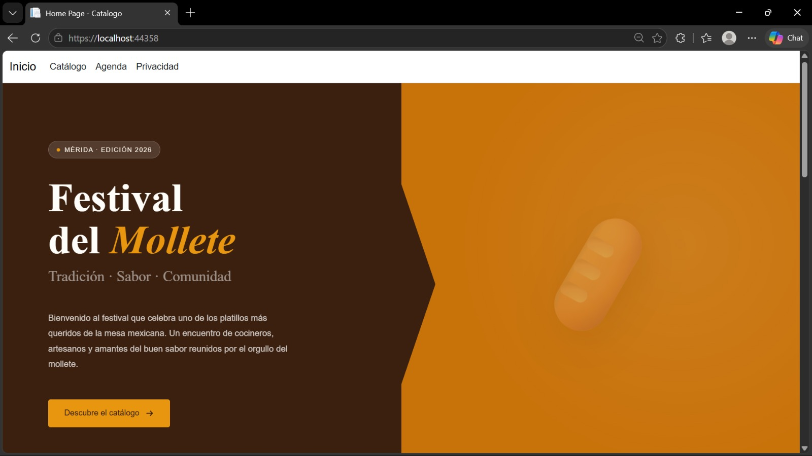
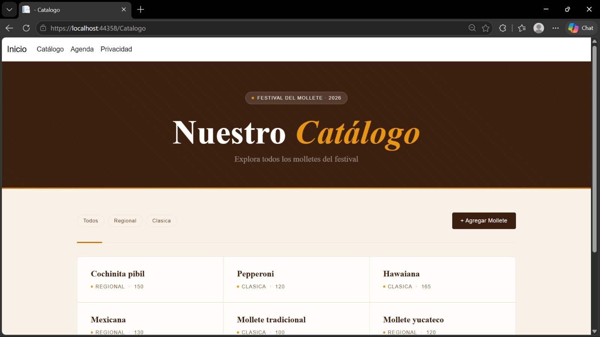
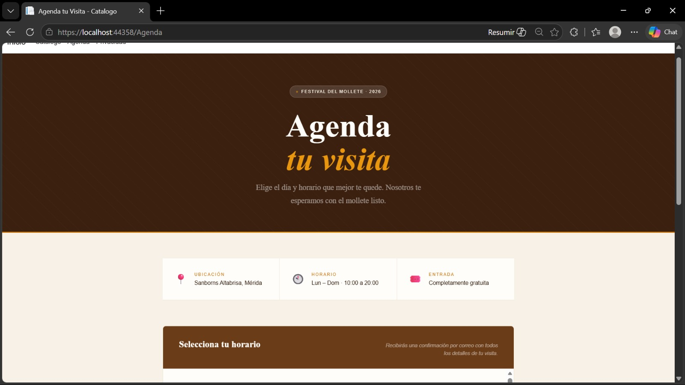
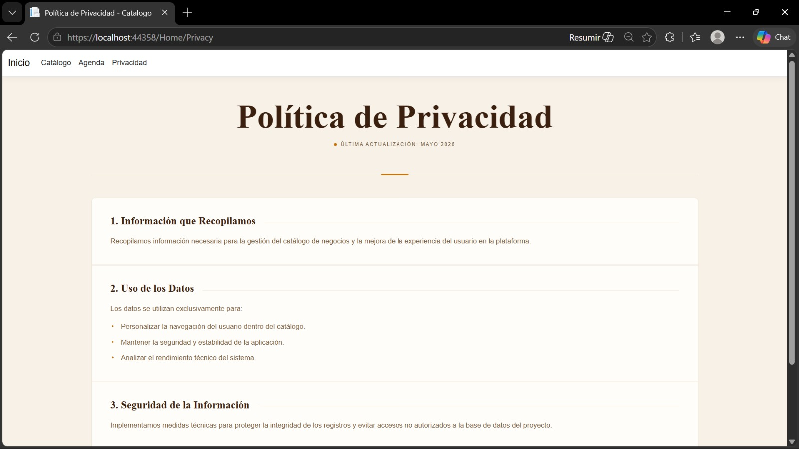

# 🫓 Festival del Mollete — Plataforma Web

## 👨‍💻 Información del Estudiante

- **Nombre:** Ariff Medina
- **Matrícula:** SW2509006
- **Grupo:** A
- **Cuatrimestre:** Tercer Cuatrimestre
- **Carrera:** TSU en Desarrollo e Innovación de Software
- **Profesor:** Jorge Javier Pedrozo Romero

---

## 📋 Descripción del Proyecto

Este repositorio contiene el código fuente de la plataforma web del **Festival del Mollete**, una aplicación desarrollada en **C# con ASP.NET Core MVC**. El proyecto implementa una interfaz de usuario con estética editorial y festiva, construida para presentar un catálogo gastronómico interactivo del festival, incluyendo información del evento, catálogo, un sistema de agenda de visitas y una política de privacidad.

Traté de que la identidad visual esté inspirada en la tradición mexicana: paleta café/ámbar con tipografía Playfair Display, tarjetas con hover interactivo y patrones decorativos tipo talavera.

---

### 📸 Capturas de Pantalla
para cada
> **Nota:** Aquí puedes ver la interfaz principal y las secciones clave de la plataforma.

| Home / Bienvenida | Catálogo de Molletes |
| :---: | :---: |
|  |  |
| **Agenda tu Visita** | **Política de Privacidad** |
|  |  |

---

## 📁 Estructura del Proyecto

```
Catalogo/
│
├── Controllers/
│   ├── HomeController.cs       # Página principal del festival
│   ├── CatalogoController.cs   # Lógica del catálogo de molletes
│   └── AgendaController.cs     # Vista de agendamiento de visitas
│
├── Models/
│   └── Item.cs                 # Entidad: Nombre, Precio, Categoría
│
├── Views/
│   ├── Home/
│   │   └── Index.cshtml        # Landing page del festival
│   │   └── Privacy.cshtml      # Política de privacidad
│   ├── Catalogo/
│   │   └── Agregar.chtml       # Agrega nuevos tipos de molletes
│   │   └── Detalle             # Muestra la información de cada mollete
│   │   └── Index.cshtml        # Catálogo con filtros y cards
│   ├── Agenda/
│   │   └── Index.cshtml        # Widget de Calendly embebido
│   ├── Shared/
│   │   ├── _Layout.cshtml      # Layout global con navbar y footer
│
├── wwwroot/
│   ├── css/
│   │   ├── site.css            # Variables globales, hero, stats, about, activities
│   │   ├── agregar.css         #
│   │   ├── Detalles.css        #
│   │   ├── catalogo.css        # Hero, toolbar de filtros, grid de cards
│   │   ├── agenda.css          # Hero, info cards, wrapper de Calendly
│   │   └── privacy.css         # Cabecera, privacy-wrapper, privacy-cards
│   └── lib/                    # Bootstrap, jQuery
│
├── Program.cs
├── appsettings.json
├── Catalogo.csproj
└── README.md
```

---

## 🗂️ Secciones de la Plataforma

### 🏠 Home — Landing Page
Página de aterrizaje del festival con:
- **Hero** de dos columnas: texto a la izquierda sobre fondo café oscuro, ilustración flotante a la derecha sobre fondo ámbar
- **Sección de estadísticas** con tres tarjetas (años de tradición, recetas, entrada gratuita)
- **Sección "Acerca del festival"** con descripción y frase de impacto en bloque de cita
- **Sección de actividades** con grid de 5 cards (talleres, concurso, música, artesanías, área infantil)
- Footer con nombre del festival y datos del evento

### 📖 Catálogo
Listado interactivo de molletes con:
- **Hero** consistente con el resto del sitio (fondo café, patrón diagonal, franja ámbar)
- **Toolbar** con pills de filtro por categoría y botón de agregar mollete
- **Grid de cards** con título (Playfair Display), categoría y precio; acento ámbar al hover
- Estado vacío cuando no hay items registrados

### 📅 Agenda tu Visita
Sección de reservaciones integrada con **Calendly**:
- Hero con badge animado y subtítulo
- Tres info cards (Ubicación, Horario, Entrada gratuita) con hover interactivo
- Widget de Calendly embebido con color primario personalizado al tono del festival
- Nota de contacto al pie

> Mi link del evento en calendly:
> ```html
> data-url="https://calendly.com/TU-USUARIO/visita-festival?primary_color=3B2010"
> ```

### 🔒 Política de Privacidad
Tres secciones informativas con:
- Información que se recopila
- Uso de los datos
- Seguridad de la información

Estilo consistente con el resto del sitio: cards con acento lateral ámbar, viñetas `▸` y tipografía Playfair Display.

---

### 🛠️ Tecnologías Utilizadas

- **Backend:** ASP.NET Core 8.0 (C#)
- **Arquitectura:** MVC (Model-View-Controller)
- **Frontend:** HTML5, CSS3 (Custom Grid & Flexbox), Vanilla JavaScript
- **Tipografías:** Playfair Display · DM Sans (vía Google Fonts)
- **Integración externa:** Calendly (widget de agendamiento)
- **Herramientas:** Visual Studio 2022, Git

---

## 🤝 Agradecimientos

- **Profesor Jorge Javier Pedrozo Romero** por la estructura del curso y la práctica
- **Tecnológico de Software** por la formación integral

---

## 📧 Contacto

- **Email Institucional:** ariff.medina@tecdesoftware.edu.mx
- **GitHub:** [AriffMedina](https://github.com/AriffMedina)

---

## 📄 Licencia

Este proyecto fue desarrollado por **Ariff Medina** como parte de las prácticas académicas para el **Tecnológico de Software**.

Distribuido bajo la Licencia MIT. Siéntete libre de utilizar la arquitectura del código y el diseño de la interfaz para fines educativos o proyectos personales, siempre y cuando se mantenga el reconocimiento al autor original.

---

## 🤖 Declaración de Uso de IA

Este proyecto integra asistencia de Inteligencia Artificial **exclusivamente para el apartado visual**, incluyendo el refinamiento de estilos CSS, la generación del sistema de diseño con variables de color y la estructuración de los componentes de cada vista.

La **arquitectura del sistema (MVC)**, la lógica de los controladores en C#, la estructuración de las vistas Razor así como la integración de tecnologías externas (calendly) fueron desarrollados íntegramente de forma manual, utilizando la IA como herramienta complementaria de diseño y documentación.

---

<div align="center">

**⭐ Si te gustó este proyecto, dale una estrella ⭐**

Hecho con 💙 por Ariff Medina — 2026

</div>
